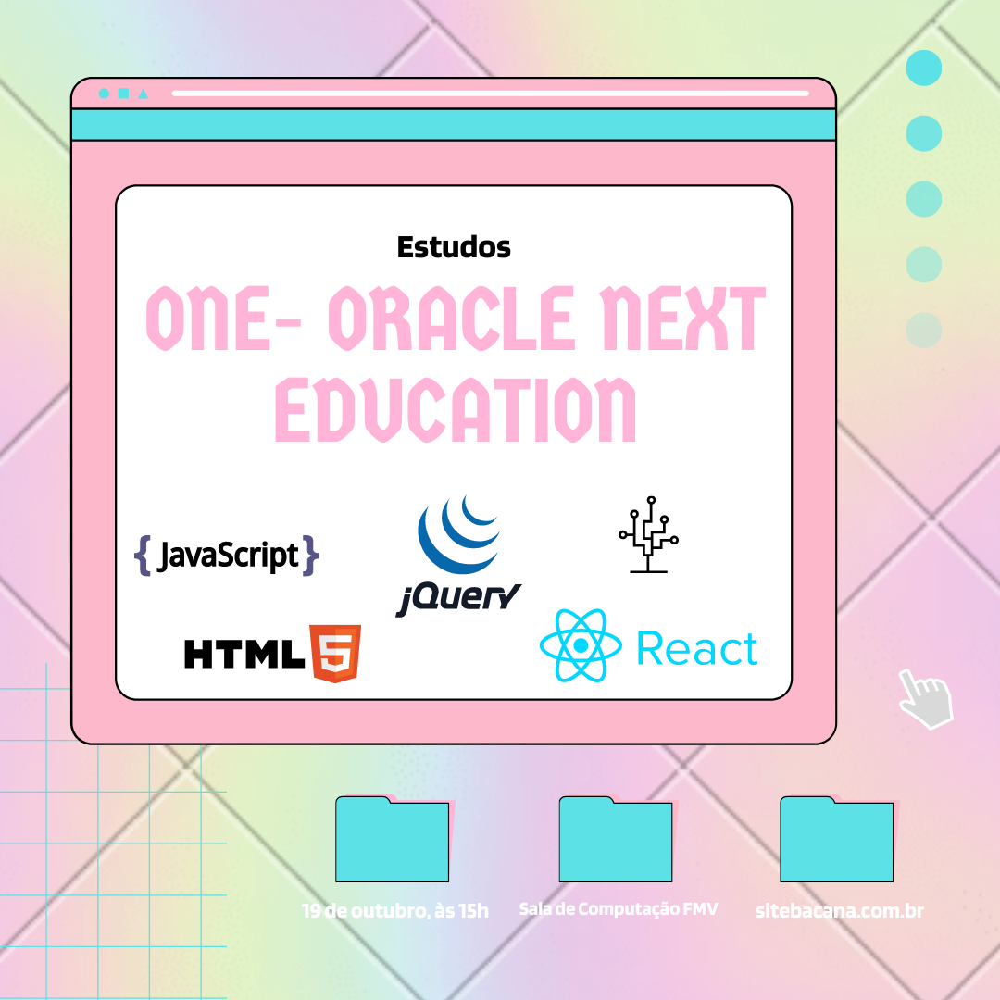

> 📚 ONE- Oracle Next Education

## ✏️ Sobre o repositorio

Deixarei aqui todos os projetos que concluí durante o curso da Oracle e da Alura.

## 💻 Tecnologias utilizadas

- HTML
- CSS
- Javascript
- JQuery
- react

---------------------------

Feito com :hearts: por <a href="https://github.com/yasxxv">yasxxv</a>
